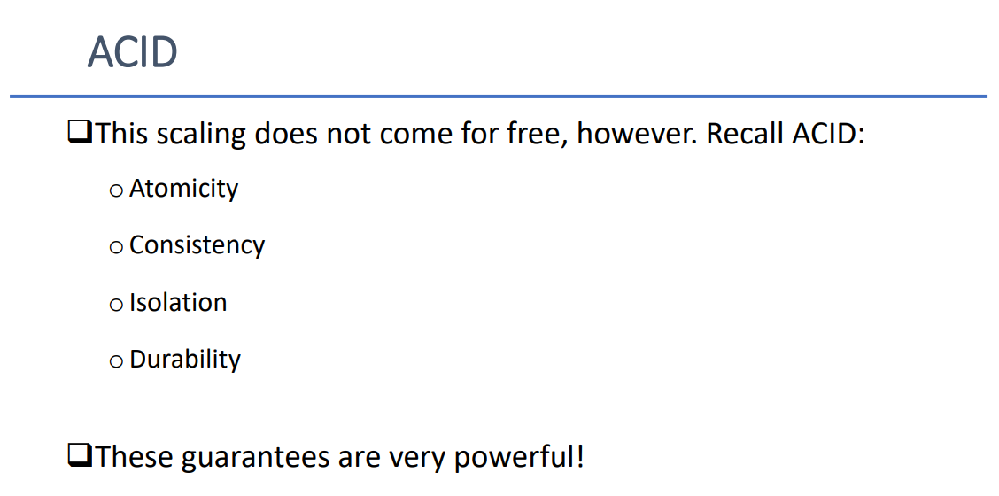
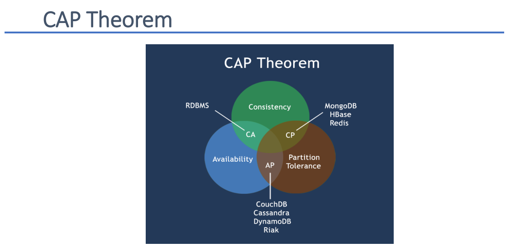
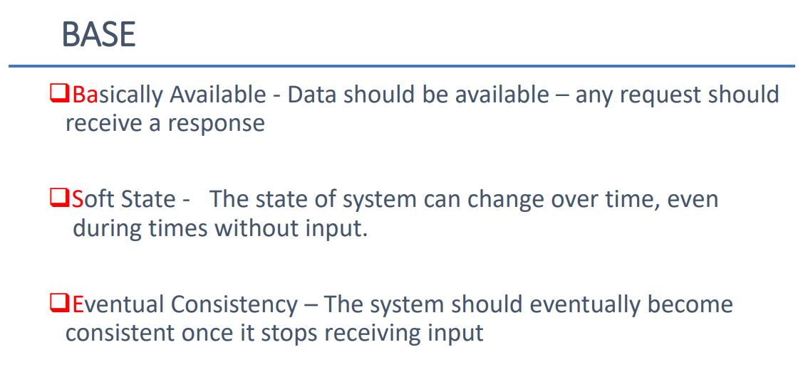

# Database II Final Review

## Table of Contents
- [SQL Review](#sql-review)
- [Packages](#packages)
- [Subprograms](#subprograms)
- [V-arrays](#v-arrays)
- [Cursors](#cursors)
- [Exceptions](#exceptions)
- [JDBC](#jdbc)
- [Object Types](#object-types)
- [Normalization](#normalization)
- [Triggers](#triggers)
- [Security](#security)
- [NoSQL](#nosql)

<div>

## SQL Review
> From last year. Not much. Just a reminder.
- Select statements (where, group by, aggregate functions)
- Indexes and Views

### Indexes
- Speeds up data retrieval when searching by other columns than primary keys
- Only use on important columns, as it can negatively affect performance if used everywhere
- Syntax:
```sql
CREATE INDEX <name> ON <table_name>(<column_name>, ...);
```

### Views
- Holds a relation to a certain query
- Can be used as table for select
- Syntax:
```sql
CREATE [MATERIALIZED] VIEW <name> AS(<select_query>);
```

### Dynamic
> Default
- Executed every time its accessed
- Can be complex and join information across tables

### Materialized
- Result is cached
- Needs maintaining (insert, update or delete will be slower)
- Faster retrieval via select

## Packages
> Imagine this as an application/group in the database.
- Encapsulates code
- Avoids naming conflicts
- Controls visibility (private/public)

### HEAD
- Package specification (subprogram headers go here)
- State what the user can access (only these subprograms are accessible from outside)
- Syntax:
```sql
CREATE [OR REPLACE] PACKAGE <name> AS
	...
END <name>;
```

### BODY
- Package implementation (completed subprograms go here)
- Must contain (in the right order) all subprograms specified in HEAD.
- Syntax:
```sql
CREATE [OR REPLACE] PACKAGE  BODY <name> AS
	...
END <name>;
```

## Subprograms
- Reuse common code
- Simplify external users' lives

### Functions
- Must return a value
- Used for computation
- Should not modify the database
- Cannot execute other procedures
- Can be used inside select statements
- Syntax:
```sql
CREATE [OR REPLACE] FUNCTION <name> [(<arg_name> <arg_type>, ...)] 
RETURN <return_type> IS
	...
BEGIN 
	...
END;
```
> Fun fact, IS and AS are aliases.

### Procedures
- Has in, out or in/out parameters
- Used to modify the database
- Can use other procedures or functions
- Syntax:
```sql
CREATE [OR REPLACE] PROCEDURE <name> [(<arg_name> [IN | OUT | IN OUT] <arg_type>, ...)] 
IS
	...
BEGIN 
	...
END;
```

## V-arrays
- Declared as a type with a size and type
- Index is 1 based (starts at 1 instead of 0)
- Variable (resizes to fit)
- Syntax:
```sql
CREATE [OR REPLACE] TYPE <name> IS VARRAY(<size>) OF <type>;
```

- Can be manually assigned (`:=`):
```sql
CREATE TYPE numberarray IS VARRAY(100) OF NUMBER; 

DECLARE 
	myarray numberarray; 
BEGIN 
	myarray(1) := 10; 
	myarray(2) := 20; 
	myarray(3) := 30; 
END;
```

- Can be dynamically filled (`BULK COLLECT INTO`):
```sql
CREATE TYPE isbnarraytype IS VARRAY(100) OF VARCHAR2(200); 

DECLARE 
	isbnarray isbnarraytype; 
BEGIN 
	select isbn bulk collect into isbnarray from books; 
END;
```

- Can be iterated (`.COUNT` & `(i)`):
```sql
DECLARE 
	isbnarray isbnarraytype; 
BEGIN select isbn bulk collect into isbnarray from books; 
	for i in 1 .. isbnarray.COUNT loop 
		dbms_output.put_line(isbnarray(i)); 
	end loop; 
END;
```

## Cursors
- Allow handling of MULTIPLE rows
- Access columns through dot notation (JS object property)

- Can be declared as types:
```
Really, don't use it this way. You'll have to use FETCH, OPEN and CLOSE which is just extra work. 
```

- Can be used directly in for loop:
```sql
BEGIN 
	FOR a_row IN (select * from books) LOOP 
		dbms_output.put_line(a_row.isbn); 
		dbms_output.put_line(a_row.cost); 
	END LOOP; 
END;
```


## Exceptions
- Occurs when there is unwanted behavior
- Provides a way to communicate errors
- Can be defined by the user
- Many are built-in (DUP_VAL_ON_INDEX, NO_DATA_FOUND, ZERO_DIVIDE, ...)
- "Bubbles" all the way up until someone catches it, or it reports the error in the output (kind of how Java works (think of the stack trace))

- Can be caught in the EXCEPTION block:
```sql
DECLARE 
	vname VARCHAR2(50) := ‘Bob’; 
	vsalary NUMBER(6,2); 
BEGIN 
	SELECT salary INTO vsalary FROM client WHERE name = vname; 
	dbms_output.put_line(vname); 
EXCEPTION 
	WHEN no_data_found THEN 
		dbms_output.put_line(‘Person does not exist’); 
	WHEN too_many_rows THEN 
		dbms_output.put_line(‘Too many people with that name!’); 
	WHEN value_error THEN 
		dbms_output.put_line(‘Value Mismatch – possibly salary too high!’); 
	WHEN others THEN 
		dbms_output.put_line('Error!'); END;
```
> Behaves like a switch in Java. Any other error is caught in others (default).

- Can be manually defined, raised (thrown) and caught:
```sql
--pretend we define this in package head named my_package
e_invalid_deptid EXCEPTION;
...
CREATE PROCEDURE add_salary(v_deptid IN uni_lecturer.dept_id%TYPE, n IN NUMBER) 
AS 
BEGIN 
	UPDATE uni_lecturer SET salary = (salary + n) WHERE dept_id = v_deptid; 
	IF SQL%NOTFOUND THEN 
		RAISE my_package.e_invalid_deptid; 
	END IF; 
	dbms_output.put_line(v_deptid ||' adjusted salary is: '||adjustment); 
END; 
… 
BEGIN 
	add_salary(4, 1000); 
EXCEPTION 
	WHEN my_package.e_invalid_deptid THEN 
		dbms_output.put_line(‘Department does not exist’); 
END;
```


## JDBC
- Library that allows Java to communicate to a database. (o in ojdbc = oracle)
- Implements the java.sql interfaces

- Examples:
```java
String username = "", password = "";  
Connection conn;  
  
//open the connection  
try {  
    conn = DriverManager.getConnection("jdbc:oracle:thin:@198.168.52.211:1521/pdbora19c.dawsoncollege.qc.ca", username, password);  
} catch (SQLException e) {  
    throw new RuntimeException(e);  
}  
  
//executeQuery (execute select statements)  
try (PreparedStatement ps = conn.prepareStatement("SELECT * FROM BOOKS WHERE title = ?")) {  
    //set ? parameter  
    ps.setString(1, "The Hobbit");  
      
    //obtain result set  
    ResultSet rs = ps.executeQuery();  
      
    //loop over each row  
    while (rs.next()) {  
        //print price of each row (book)  
        System.out.println(rs.getString("price"));  
    }  
} catch (SQLException e) {  
    throw new RuntimeException(e);  
}  
  
//executeUpdate (execute insert, update, delete statements)  
try (PreparedStatement ps = conn.prepareStatement("UPDATE BOOKS SET price = 20 WHERE title = ?")) {  
    //set ? parameter  
    ps.setString(1, "The Hobbit");  
      
    //execute the update statement (no result set to get, we are updating)  
    ps.executeUpdate();  
} catch (SQLException e) {  
    throw new RuntimeException(e);  
}  
  
//execute (call functions/procedures)  
try (CallableStatement cs = conn.prepareCall("{ call updateCategory(?, ?, ?)}")) {  
    //set ? parameters  
    cs.setString(1, "title");  
    cs.setInt(2, 30);  
      
    //register OUT parameter of procedure  
    cs.registerOutParameter(3, Types.VARCHAR);  
      
    //execute the procedure  
    cs.execute();  
      
    //get the OUT parameter  
    String result = cs.getString(3);  
} catch (SQLException e) {  
    throw new RuntimeException(e);  
}  
  
//execute (call functions/procedures)  
try (CallableStatement cs = conn.prepareCall("{ ? = call getBook(?, ?)}")) {  
    //register function return value  
    cs.registerOutParameter(1, Types.VARCHAR);  
  
    //set ? parameters  
    cs.setString(2, "title");  
    cs.setInt(3, 30);  
      
    //execute the function  
    cs.execute();  
  
    //get the return value  
    String result = cs.getString(3);  
} catch (SQLException e) {  
    throw new RuntimeException(e);  
}  
  
//close the connection to release resources (very important)  
try {  
    if (!conn.isClosed()) conn.close();  
} catch (SQLException e) {  
    throw new RuntimeException(e);  
}
```

## Object Types
> Data type representing an object
- Declare properties as you would declare columns in a table
- Primarily used with Java
- Properties/columns are accessed through dot notation
- Syntax:
```sql
CREATE [OR REPLACE] <name> AS OBJECT (
	...
);
```

- Can be used as parameters in procedures/functions:
```sql
CREATE OR REPLACE PROCEDURE UPDATE_USER(user IN JLUSER_TYPE) AS  
BEGIN  
    UPDATE JLUSERS SET salt = user.salt,  
                       hash = user.hash,  
                       failedLoginCount = user.failedLoginCount  
        WHERE userID = user.userID;  
END;
```

- Can be returned by functions:
```sql
CREATE OR REPLACE FUNCTION GET_USER(userID_ IN VARCHAR2) RETURN JLUSER_TYPE IS  
    user JLUSER_TYPE;  
BEGIN  
    SELECT JLUSER_TYPE(userID, salt, hash, failedLoginCount) INTO user FROM JLUSERS WHERE userID = userID_;  
    RETURN user;  
END;
```

### Objects in JDBC
0. Create an object in the database.
```sql
CREATE TYPE JLUSER_TYPE AS OBJECT (  
    userID VARCHAR(20),  
    salt RAW(16),  
    hash RAW(64),  
    failedLoginCount NUMBER(1)  
);
```

1. Create a class that implements the SQLData interface.
```java
public class User implements SQLData {  
    public static final String SQL_TYPE_NAME = "JLUSER_TYPE";  
  
    private String userID;  
    private byte[] salt;  
    private byte[] hash;  
    private long failedLoginCount;  
      
    public User() {  
  
    }  
  
    public User(String userID, byte[] salt, byte[] hash, long failedLoginCount) {  
        this.userID = userID;  
        this.salt = salt;  
        this.hash = hash;  
        this.failedLoginCount = failedLoginCount;  
    }
}
```

2. Override the interface's methods.
```java
@Override  
public String getSQLTypeName() {  
    return SQL_TYPE_NAME;  
}  
  
@Override  
public void readSQL(SQLInput stream, String typeName) throws SQLException {  
    userID = stream.readString();  
    salt = stream.readBytes();  
    hash = stream.readBytes();  
    failedLoginCount = stream.readInt();  
}  
  
@Override  
public void writeSQL(SQLOutput stream) throws SQLException {  
    stream.writeString(userID);  
    stream.writeBytes(salt);  
    stream.writeBytes(hash);  
    stream.writeInt((int) failedLoginCount);  
}
```

3. Map the object to the connection. (the type name was declared in step 1 and it is the name of the object created in step 0)
```java
Connection conn = DriverManager.getConnection("jdbc:oracle:thin:@198.168.52.211:1521/pdbora19c.dawsoncollege.qc.ca", username, password);  
Map<String, Class<?>> typeMap = conn.getTypeMap();  
typeMap.put(User.SQL_TYPE_NAME, User.class);  
conn.setTypeMap(typeMap);  
```

4. Congratulations, you can now use objects in your CallableStatements.
```java
private IUser getUser(String username) {  
    //null by default  
    IUser user = null;  
  
    //function call  
    try (CallableStatement cs = conn.prepareCall("{ ? = call GET_USER(?) }")) {  
        //register our return object  
        cs.registerOutParameter(1, Types.STRUCT, User.SQL_TYPE_NAME);  
  
        //set ? parameters  
        cs.setString(2, username);  
          
        //execute  
        cs.execute();  
  
        //get the object (we need to cast)  
        user = (IUser) cs.getObject(1);  
    } catch (SQLException ignored) {}  
  
    return user;  
}  
  
private void UpdateDB(IUser user) {  
    //procedure call  
    try (CallableStatement cs = conn.prepareCall("{ call ADD_USER(?) }")) {  
        //set the IN parameter  
        cs.setObject(1, user);  
          
        //execute  
        cs.execute();  
  
        System.out.println("The database was successfully updated.");  
    } catch (SQLException e) {  
        System.out.println("There was an error while updating the database. Please try again.");  
    }  
}
```

## Normalization
> Too lazy and this is a lot to explain
- Prevents data anomalies which happen when you update, insert or delete data
- For examples: check the slides

> ChatGPT explains the three normal forms:
### 1NF
- This is the most basic form of normalization and it states that each column in a table should contain a single value, and that each row should be unique. This means that a table should not have any repeating groups or multi-valued attributes.

### 2NF
- This form builds on the first and states that all non-key attributes in a table must be dependent on the whole of the primary key. This means that a table should not have any partial dependencies on the primary key.

### 3NF
- This form builds on the first two and states that all attributes in a table must be directly dependent on the primary key. This means that a table should not have any transitive dependencies on the primary key.

## Triggers
- Procedure that runs when something happens
- No parameters, but instead values available in the scope
- Lots of disadvantages, but ideal for logging purposes
- Syntax:
```sql
CREATE [OR REPLACE] TRIGGER <name>
{BEFORE | AFTER} {INSERT | UPDATE | DELETE} ON <table_name>
[FOR EACH ROW]
BEGIN
	...
END;
```

- Working with values: (insert has no OLD, delete has no NEW)
```sql
CREATE TRIGGER after_products_update 
BEFORE UPDATE ON products 
FOR EACH ROW 
BEGIN 
	IF :NEW.quantity = 0 THEN 
		:NEW.quantity = 5; 
	END IF; 
END
```

## Security
> Methods to prevent no-no
1. Physical security (real world access to the server)
2. Using ? and the set methods of JDBC (already cleans and sanitizes inputs)
3. Stored procedures (no direct contact to database using select, etc.)
4. Managing permissions and privileges (admin)
5. Hashing passwords (don't store passwords as plain text)

### Hashing
- One way (mostly) process of encoding/encrypting bytes
- Result is a fixed size length string
- Multiple algorithms, each with different methods
- The point of hashing is that we only want to compare two passwords, not know them or show them. Therefore, we hash with the same algorithm upon signup and login to compare the result.

### Salt
- Hashing passwords is not enough, because hackers will try hashes of common passwords.
- So we add a random string of characters that we store, resulting in the hash being different.
- Generate salt randomly and securely. Salt can be stored plainly in the database because it is impossible to reverse either way.

#### SQL
- Save username as a VARCHAR2, hash and salt as RAW (independently).

#### Java
1. Generate salt
```java
SecureRandom sr = SecureRandom.getInstance("SHA1PRNG"); 
byte[] salt = new byte[16]; 
sr.nextBytes(salt); //fills the salt array
```

2. Generate the hash
```java
String pwd = "";
int iterations = 5; //number of layers
PBEKeySpec spec = new PBEKeySpec(pwd, salt, iterations, 64 * 8); 
SecretKeyFactory skf = SecretKeyFactory.getInstance("PBKDF2WithHmacSHA1"); 
byte[] hash = skf.generateSecret(spec).getEncoded();
```

3. Compare two hashes
```java
//get user from db
IUser dbUser = getUser(user);

//init
byte[] salt = dbUser.getSalt();  
byte[] hash = dbUser.getHash();  
byte[] check_hash;  
  
//create secure keyspec  
PBEKeySpec spec = new PBEKeySpec(password.toCharArray(), salt, 5, hash.length * 8);  
  
try {  
    //create hash  
    SecretKeyFactory skf = SecretKeyFactory.getInstance("PBKDF2WithHmacSHA1");  
    check_hash = skf.generateSecret(spec).getEncoded();  
} catch (NoSuchAlgorithmException | InvalidKeySpecException e) {  
    System.out.println("There was an error while hashing your password. Please try again.");  
    return false;  
}  
  
//check if hashes match  
boolean same = Arrays.equals(hash, check_hash);
```

## NoSQL
> Honestly, this is not important so I'll just copy paste "maybe-important" information
- Other databases which are not relational.
- Some examples: MongoDB (my favorite), Redis, Cassandra
- 
- 
- 